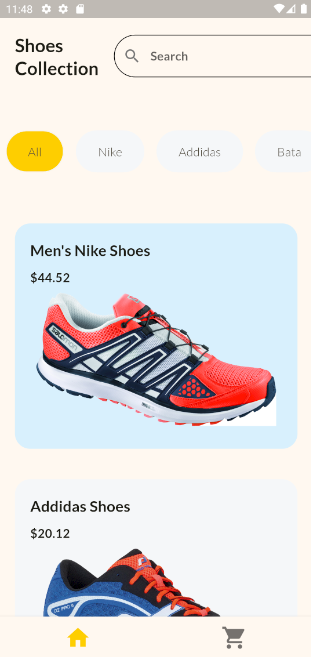
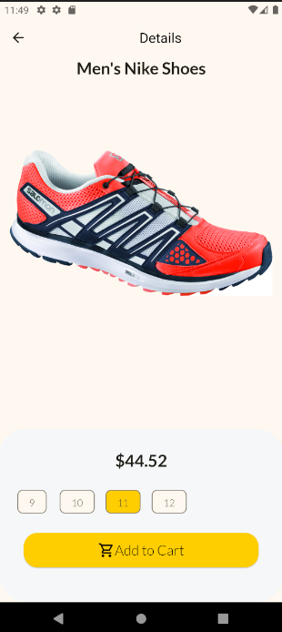
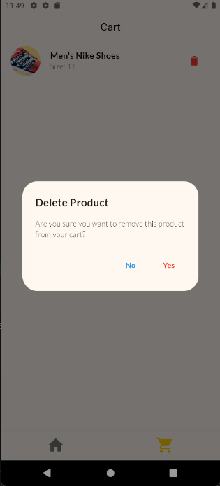

# Flutter Shopping App

This project is a basic shopping app built with Flutter, designed to learn and implement state management techniques. Below is a brief overview of the app’s features, dependencies, and instructions for running the project.

---

## Features

1. **Product Listing Page**:
   - Displays a collection of shoes categorized by brand.
   - Users can browse products and view their prices.

2. **Product Details Page**:
   - Shows detailed information about a selected product.
   - Allows users to select the shoe size.
   - Provides an option to add the product to the cart.

3. **Cart Management**:
   - Displays the list of products added to the cart.
   - Enables users to delete items from the cart with a confirmation dialog.

---

## Screenshots

### Product Listing Page


### Product Details Page


### Cart Page


---

## Technologies and Tools

- **Flutter**: Framework for building natively compiled applications.
- **Dart**: Programming language used in Flutter development.

---

## State Management
This app utilizes the following state management techniques:

1. **Provider**: Handles state updates and notifies widgets when changes occur.
2. **Stateful Widgets**: Used for local state management in small components.

---

## How to Run the App

1. **Clone the Repository**:
   ```bash
   git clone <repository_url>
   cd <repository_name>
   ```

2. **Install Dependencies**:
   ```bash
   flutter pub get
   ```

3. **Run the App**:
   - On a connected device or emulator, run:
     ```bash
     flutter run
     ```

4. **Build APK (Optional)**:
   ```bash
   flutter build apk
   ```

---

## Future Enhancements

- Implement user authentication.
- Add a backend for real-time data fetching.
- Introduce payment gateway integration.
- Enhance UI/UX with animations and transitions.

---


---

## Contact
For any queries or suggestions, please reach out to [Your Email/Contact Info].

